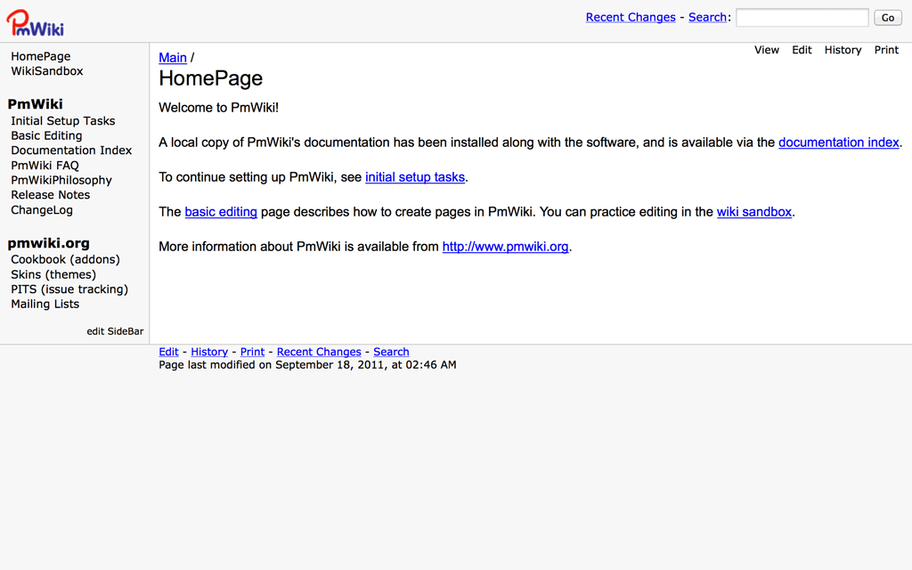

<!--
Ohart ongi: README hau automatikoki sortu da <https://github.com/YunoHost/apps/tree/master/tools/readme_generator>ri esker
EZ editatu eskuz.
-->

# PmWiki YunoHost-erako

[](https://ci-apps.yunohost.org/ci/apps/pmwiki/)  

[](https://install-app.yunohost.org/?app=pmwiki)

*[Irakurri README hau beste hizkuntzatan.](./ALL_README.md)*

> *Pakete honek PmWiki YunoHost zerbitzari batean azkar eta zailtasunik gabe instalatzea ahalbidetzen dizu.*  
> *YunoHost ez baduzu, kontsultatu [gida](https://yunohost.org/install) nola instalatu ikasteko.*

## Aurreikuspena

PmWiki is a wiki-based content-management system (CMS) for collaborative creation and maintenance of websites. 

### Features

- Custom look-and-feel
- Access control
- Customization and plugin architecture

**Paketatutako bertsioa:** 2.3.32~ynh5

## Pantaila-argazkiak



## Dokumentazioa eta baliabideak

- Aplikazioaren webgune ofiziala: <https://www.pmwiki.org>
- Erabiltzaileen dokumentazio ofiziala: <https://www.pmwiki.org/wiki/PmWikiFr/PmWikiUsers>
- Administratzaileen dokumentazio ofiziala: <https://www.pmwiki.org/wiki/PmWikiFr/PmWikiFr>
- YunoHost Denda: <https://apps.yunohost.org/app/pmwiki>
- Eman errore baten berri: <https://github.com/YunoHost-Apps/pmwiki_ynh/issues>

## Garatzaileentzako informazioa

Bidali `pull request`a [`testing` abarrera](https://github.com/YunoHost-Apps/pmwiki_ynh/tree/testing).

`testing` abarra probatzeko, ondorengoa egin:

```bash
sudo yunohost app install https://github.com/YunoHost-Apps/pmwiki_ynh/tree/testing --debug
edo
sudo yunohost app upgrade pmwiki -u https://github.com/YunoHost-Apps/pmwiki_ynh/tree/testing --debug
```

**Informazio gehiago aplikazioaren paketatzeari buruz:** <https://yunohost.org/packaging_apps>
